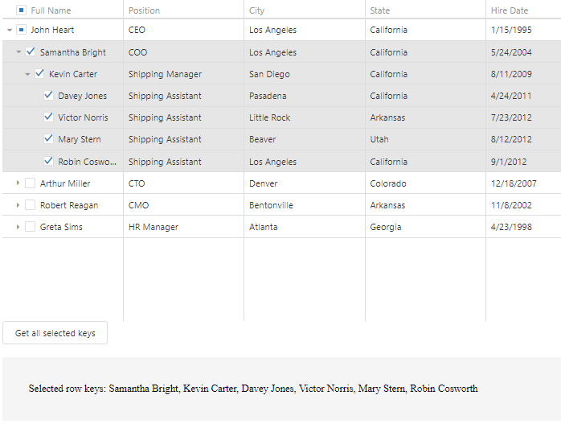

<!-- default badges list -->

<!-- default badges end -->
# TreeList for DevExtreme - How to get all selected nodes in recursive selection mode

This example demonstrates how to obtain selected TreeList keys on demand. Click the "Get all selected keys" button to see the result.

Check the `getAllSelectedNodes` function to see how to collect selected nodes.

## Files to Review

- **jQuery**
    - [index.js](jQuery/src/index.js)
- **Angular**
    - [app.component.html](Angular/src/app/app.component.html)
    - [app.component.ts](Angular/src/app/app.component.ts)
- **Vue**
    - [HomeContent.vue](Vue/src/components/HomeContent.vue)
- **React**
    - [App.tsx](React/src/App.tsx)
- **ASP.NET Core**
    - [Index.cshtml](ASP.NET%20Core/Views/Home/Index.cshtml)

## Documentation

- [Getting Started with TreeList](https://js.devexpress.com/Documentation/Guide/UI_Components/TreeList/Getting_Started_with_TreeList/)
- [TreeList - API Reference](https://js.devexpress.com/Documentation/ApiReference/UI_Components/dxTreeList/)
<!-- feedback -->
## Does This Example Address Your Development Requirements/Objectives?

 

(you will be redirected to DevExpress.com to submit your response)
<!-- feedback end -->
