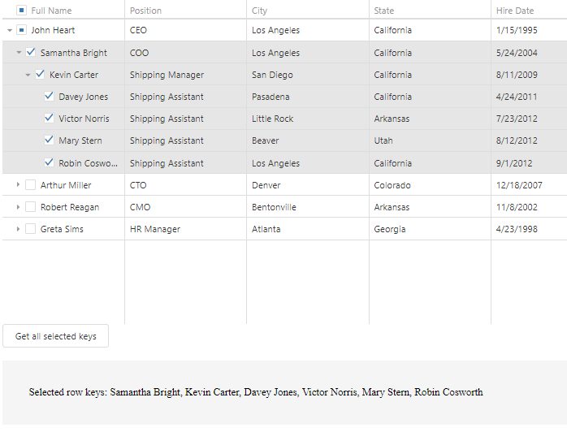

<!-- default badges list -->

<!-- default badges end -->

# DevExtreme TreeList - How to get all selected nodes in recursive selection mode

This example demonstrates how to obtain selected TreeList keys on demand. Click the "Get all selected keys" button to see the result.

Check the getAllSelectedNodes function to see how to collect selected nodes.

<!-- run online -->
**[[Run Online]](https://codecentral.devexpress.com/128584164/)**
<!-- run online end -->

## Files to Review

- **JS**
  - [index.js](JS/index.js)

## Documentation

- [Getting Started with TreeList](https://js.devexpress.com/Documentation/Guide/UI_Components/TreeList/Getting_Started_with_TreeList/)

- [TreeList - API Reference](https://js.devexpress.com/Documentation/ApiReference/UI_Components/dxTreeList/)

